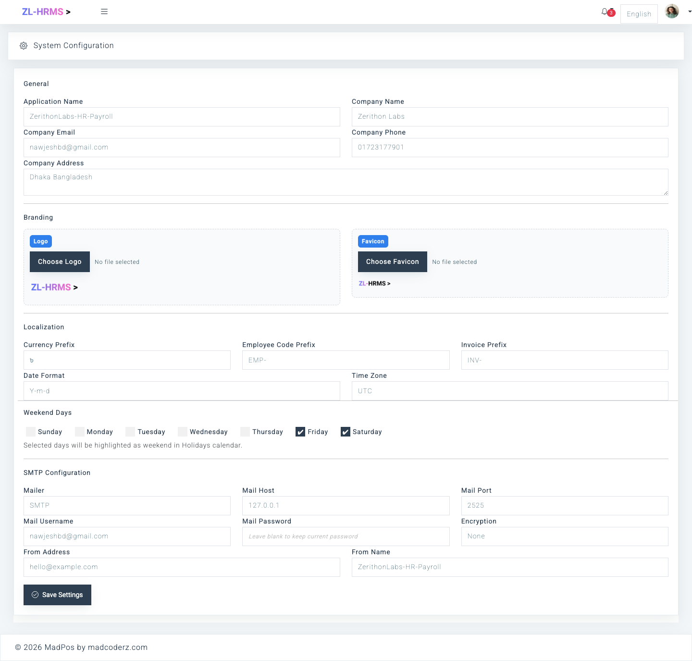
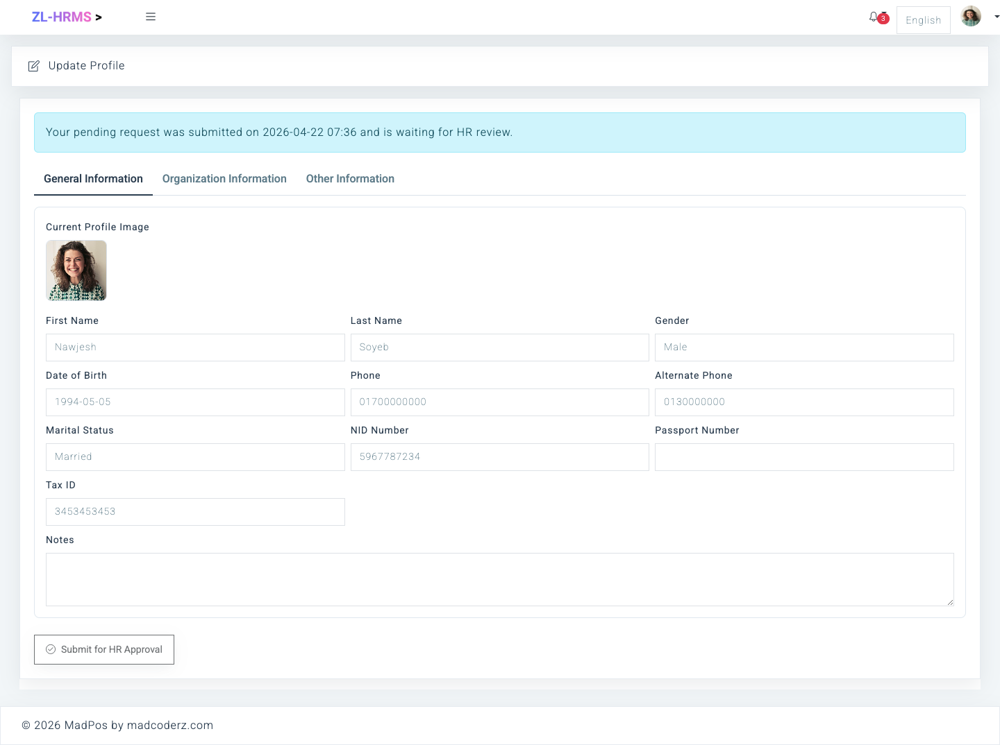
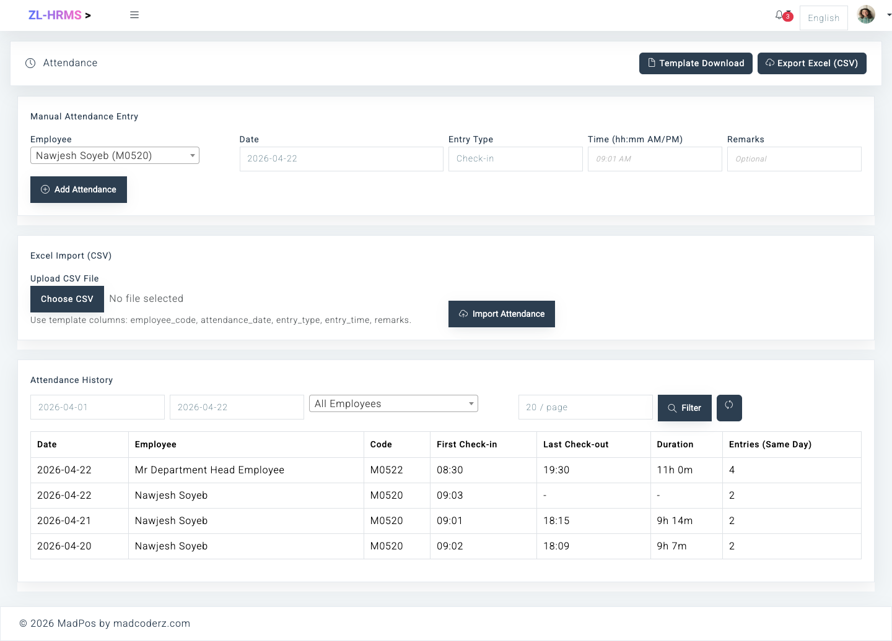
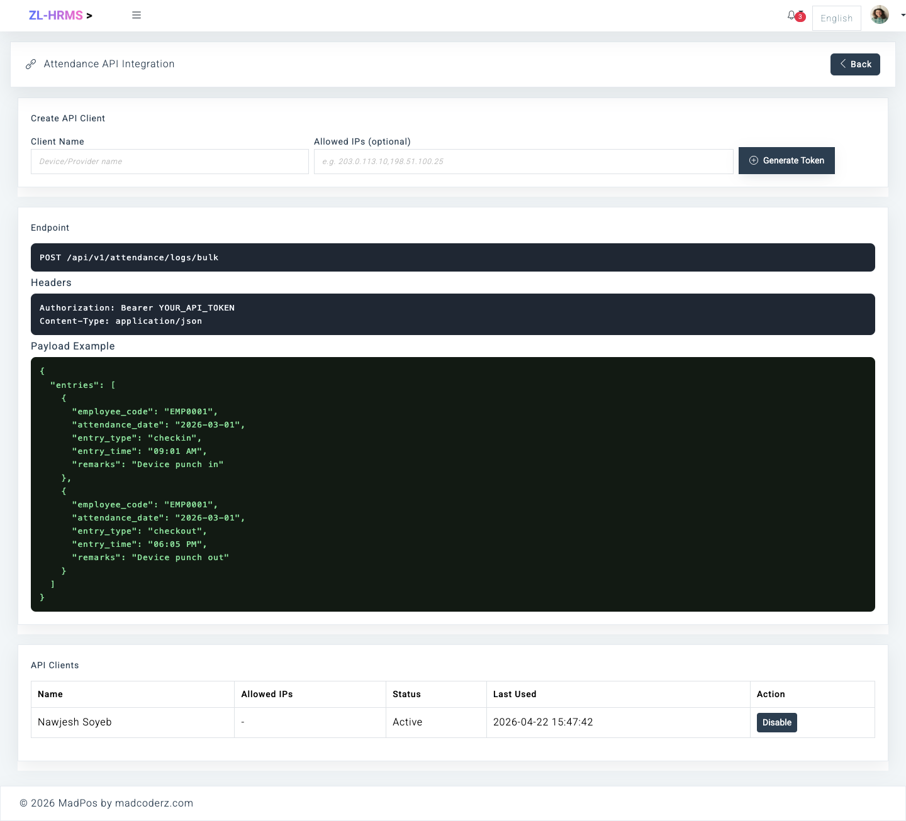

# HR Payroll

Zerithonlabs - Modern HRM + Payroll platform rebuilt with Laravel for real company workflows and long-term maintainability.

> Legacy version note: this `main` branch is the Laravel rebuild. Older legacy implementation may exist in a separate branch.

<p align="center">
  
</p>

<h2 align="center">Live Demo</h2>

<p align="center">
  Explore the hosted Zeri HR demo environment.
</p>

<p align="center">
  <a href="https://hr.zerithonlabs.com" target="_blank">
    
  </a>
</p>

<h3 align="center">💛 Support My Work</h3>

<p align="center">
  Your support helps me continue building better software, maintaining open-source projects, and creating useful tools through MADCODERZ.
</p>

<p align="center">
  <a href="https://nawjesh.lemonsqueezy.com/checkout/buy/8f9caf36-362e-4f35-b645-5efb6d5df60d" target="_blank">
    
  </a>
  &nbsp;
  <a href="https://www.hostinger.com?REFERRALCODE=HHPNAWJES5CA" target="_blank">
    
  </a>
</p>

## Why This Project

A complete HRM and Payroll platform for organizations that need one system to manage employee lifecycle, attendance, leave, payroll, approvals, and reporting.

It is designed with a modular Laravel architecture so teams can run day-to-day HR operations with cleaner structure, maintainability, and long-term scalability.

## Main Features

- Role-based HR dashboard with employee, attendance, leave, notice and quick-note widgets
- Employee lifecycle management with profile updates, employee status, departments, designations and reporting lines
- Employee self-service login for own profile, attendance, leave, tasks, payslips, loans, deductions and provident fund records
- Attendance management with clock in/out, time change requests, reports, print and export
- Leave management with categories, quotas, balances, applications, approvals and reports
- Resignation workflow with employee apply, supervisor review and final HR/Admin approval
- Notices, announcements, holidays and holiday calendar
- Teams, projects, tasks, members, file preview and comments
- Salary grades, reusable salary templates and employee-specific salary assignment
- Payroll draft generation, review, final submission, payslips, payment status and payroll reports
- Bonus, employee loan, deduction and provident fund management
- Loan approval workflow with supervisor approval, final approval and salary-based installment deduction
- Confidential payroll access: employees see only own salary data unless explicit payroll permissions are assigned
- Reports for employees, attendance, leave and payroll with scoped data access
- Dynamic database-driven roles and permissions with scope labels
- Notifications, private notes and user account approval
- Settings-managed company profile and SMTP configuration
- Responsive Bootstrap-based admin interface

## Language Support

Zeri HR includes multilingual UI support for core HR, payroll and admin screens.

🇺🇸 English &nbsp; 🇩🇪 German &nbsp; 🇫🇷 French &nbsp; 🇮🇳 Hindi

## Screenshots

### 1. Settings Page



### 2. Update Profile



### 3. Holiday Calendar


### 4. Attendance & API Integration





## Tech Stack

- PHP 8.2+
- Laravel 12
- MySQL
- Blade templates
- Bootstrap-based admin UI
- Vite

## Quick Start

1. Clone and enter the project

```bash
git clone https://github.com/Devnawjesh/hr-payroll.git
cd hr-payroll
```

2. Install dependencies

```bash
composer install
npm install
```

3. Configure environment

```bash
cp .env.example .env
php artisan key:generate
```

4. Set DB credentials in `.env`, then run:

```bash
php artisan migrate
php artisan db:seed --class=AdminUserSeeder
```

The default admin seeder creates all permissions, default organization roles, role-permission assignments, and the default admin user.

5. Run app

```bash
php artisan serve
npm run dev
```

## Default Seeded Admin

- Email: `admin@zerihr.local`
- Password: `password`
- Role: `Admin`

You can change these values before seeding by setting:

```env
DEFAULT_ADMIN_NAME="System Admin"
DEFAULT_ADMIN_EMAIL=admin@zerihr.local
DEFAULT_ADMIN_PASSWORD=password
```

## Default Organization Roles

The default seed creates ready-to-edit role templates for a typical organization:

- `Super Admin` and `Admin` with full permissions
- `HR Admin` and `HR Manager` for HR operations and approvals
- `Payroll Manager` for salary, payroll, payslip, bonus, loan, deduction and provident fund modules
- `Finance Manager` for billing, invoices, estimates, expenses and finance reports
- `Department Head`, `Supervisor`, `Project Manager` and `Team Lead` for scoped team/project workflows
- `Auditor` for read-only review access
- `Employee` for self-service profile, attendance, leave, task and own payroll records

Admin or HR users can adjust these default mappings later from the Roles and Permissions screens.

## Demo Users

For demo environments, seed four ready-to-use users:

```bash
php artisan db:seed --class=DemoUserSeeder
```

All demo users use password `P@ssword`.

| Role | Email |
| --- | --- |
| Admin | `demo.admin@zerihr.local` |
| HR Admin | `hr.admin@zerihr.local` |
| Department Head | `department.head@zerihr.local` |
| Employee | `employee@zerihr.local` |

The login page includes these demo accounts with copy buttons for visitors.

## Access Model (Current)

Access is permission-driven. The default seed creates common organization roles and assigns practical permissions by default. Admin or HR users can change those permissions later based on company policy.

Menus and module actions are shown or hidden based on assigned permissions.  
Self-service profile update remains available via topbar dropdown when user is linked to an employee profile.

Basic role scope:

- `Employee`: own profile, attendance, leave, assigned work, payslips, loans, deductions and provident fund records
- `Department Head` / `Supervisor`: own records plus scoped department/team attendance, leave, resignation and work approvals
- `HR Admin` / `HR Manager`: employee lifecycle, attendance, leave, profile updates, resignations and HR reports
- `Payroll Manager` / `Finance Manager`: salary setup, payroll runs, payslips, bonuses, loans, deductions, provident fund and payroll reports
- `Admin` / `Super Admin`: full system setup, roles, permissions, settings and all modules

Payroll, payslip, loan, deduction and provident fund data are confidential. Department heads and supervisors do not see subordinate salary data unless explicit payroll permissions are assigned.

## Payroll Flow

Payroll uses three salary setup layers:

- `Salary Grade`: employee level and allowed salary range. Example: Officer, 30,000-60,000.
- `Salary Template`: reusable salary structure/defaults. Example: basic salary, house rent, medical allowance, PF percent and tax percent.
- `Employee Salary Assignment`: the actual employee salary for an effective date range. This is the payroll source of truth.

This means many employees can share one salary grade and one salary template, while still having different actual salary amounts.

Employee salary assignment is managed from:

- `Payroll > Salary Templates > Assign Employee Salary`
- `Payroll > Salary Templates > Employee Salaries`
- Direct route: `/payroll/salary-template-assignments`

Assignment rules:

- basic salary must stay inside the employee salary grade min/max range
- overlapping employee salary assignment date ranges are blocked
- assigning a new active salary closes the previous active assignment automatically
- payroll generation fails if an active employee has no active salary assignment for the payroll period

`CTC Amount` means Cost to Company. It is optional and represents total company cost for the employee, such as gross salary plus employer-paid benefits or employer PF. If employer-side benefits are not tracked, it can be left empty or set equal to gross salary.

Payroll is generated as a draft first. HR or Payroll reviews the draft payslips, then final submits the payroll run. Final submission posts salary-linked effects such as due loan installments and provident fund transactions.

Provident Fund setup supports both employee and employer contributions. Employee PF is deducted from salary. Employer PF is company contribution and does not reduce employee net salary. Both are calculated from the active employee basic salary for the payroll period, so a salary increase automatically changes both contribution amounts in future payroll runs.

Payroll run and payslip status are separate:

- payroll run `draft`: generated but not final submitted
- payroll run `processed`: final submitted and salary-linked effects posted
- payslip/payment `pending`: salary is calculated but payment has not been marked as paid
- payslip/payment `paid`: payment has been marked as paid from the payslip detail page

Employee salary permissions:

- `employee_salary.view`: view employee salary module access
- `employee_salary.list`: view employee salary assignment table
- `employee_salary.detail`: view one salary assignment detail page
- `employee_salary.assign`: assign actual salary to an employee
- `employee_salary.update`: update employee salary records when implemented
- `employee_salary.history`: view salary history when implemented

## Loan Flow

Employee loans are created with a `Principal Amount`, installment count, issued date and first installment date.

Loan amount fields:

- `Principal Amount`: total amount given to the employee
- `Interest %`: optional simple interest percent
- `Installment Count`: number of installments to split repayment into
- `Installment Amount`: calculated from principal amount, interest percent and installment count

Installment amount formula:

```text
total_payable = principal_amount + (principal_amount * interest_percent / 100)
installment_amount = total_payable / installment_count
```

Example:

```text
Principal Amount: 60,000
Interest: 0%
Installment Count: 6
Installment Amount: 10,000
```

If interest is used:

```text
Principal Amount: 60,000
Interest: 10%
Total Payable: 66,000
Installment Count: 6
Installment Amount: 11,000
```

The application calculates the installment amount when principal amount or installment count changes. The backend also recalculates the value when saving or rescheduling, so users do not need to manually decide the installment amount.

When a loan becomes active, installment rows are generated monthly from the first installment date. During payroll generation, pending installments with due dates inside the payroll period are added to `loan_deduction`. When the payroll run is final submitted, those installments are marked paid and linked to the payroll item.

Rescheduling:

- allowed only when no installment has been paid
- recalculates installment amount from principal amount, interest percent and count
- deletes the old pending schedule and creates a new schedule
- blocked after any installment is paid to protect payroll history

## Deduction Flow

Employee Deductions are for non-loan payroll deductions such as welfare fund, penalties, advance adjustment or one-time salary adjustment. Loan repayments should use the Loan module because loans need installment balance tracking.

Deduction rules:

- `Fixed Amount`: deducts the exact amount entered
- `Percent of Basic Salary`: deducts the entered percent from the employee salary assignment basic salary
- `Every Monthly Payroll`: applies only to monthly payroll runs
- `Every Weekly Payroll`: applies only to weekly payroll runs
- `One Payroll Only`: applies only when the deduction start date is inside the payroll run period
- only active deductions inside the effective date range are included
- included deductions are stored in the payslip deduction breakdown and summed into `other_deduction`

For full module and permission details, see `Documentation/index.html`.

## SMTP and Outbound Email

SMTP values are configured from the **Settings** page and stored in DB-backed system settings.

Current implemented email flow:

- when a permitted user creates a user, credentials can be emailed
- sender config is loaded from system settings (mailer/host/port/username/password/from)

## Project Structure (High Level)

- `app/Modules/Employees` employee domain
- `app/Modules/Users` user, role, permission domain
- `app/Modules/Settings` system and SMTP settings
- `resources/views/hr` backend UI
- `database/seeders` permissions, settings and default admin user seeders

## Contributing

Contributions are welcome.

1. Fork the repository
2. Create a feature branch
3. Commit with clear messages
4. Open a pull request with:
   - problem statement
   - approach
   - screenshots (if UI)
   - migration/seed impact

## Roadmap

- stronger test coverage (feature + service tests)
- audit trail improvements
- notification system enhancements
- API layer for external integrations
- richer reporting and exports

<p align="center">
  
</p>

<h3 align="center">💛 Support My Work</h3>

<p align="center">
  Your support helps me continue building better software, maintaining open-source projects, and creating useful tools through MADCODERZ.
</p>

<p align="center">
  <a href="https://nawjesh.lemonsqueezy.com/checkout/buy/8f9caf36-362e-4f35-b645-5efb6d5df60d" target="_blank">
    
  </a>
  &nbsp;
  <a href="https://www.hostinger.com?REFERRALCODE=HHPNAWJES5CA" target="_blank">
    
  </a>
</p>

## License

MIT
